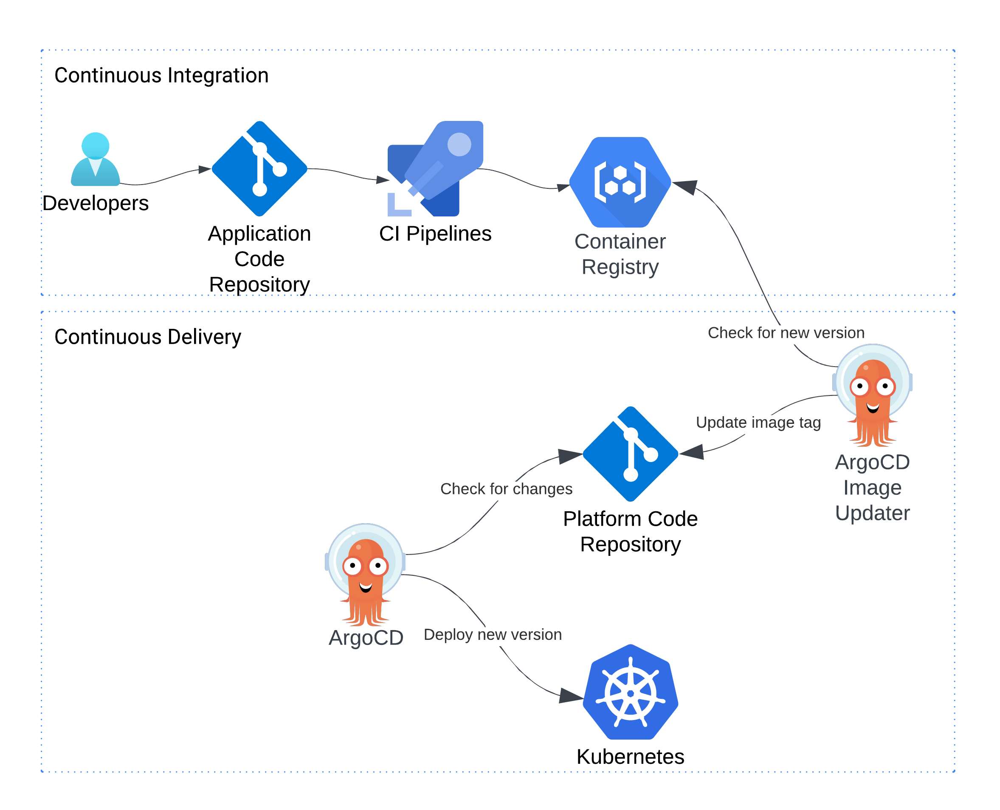
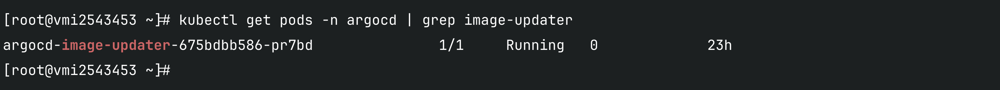
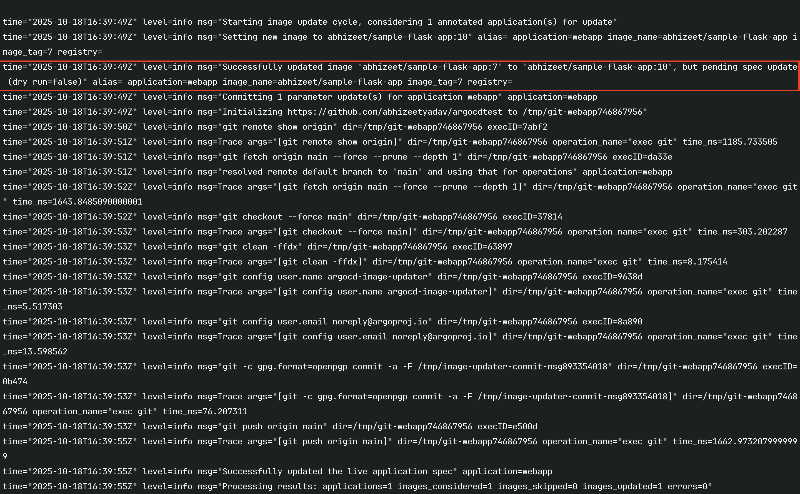
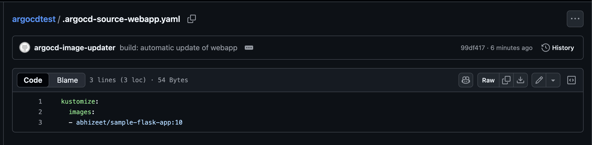

# Automating Kubernetes Deployments with Argo CD Image Updater

Modern DevOps teams strive for **speed, reliability, and automation** in their deployment pipelines.  
In Kubernetes environments, **Argo CD** is the de-facto GitOps controller — but manually updating image tags in manifests can quickly become a bottleneck.

This post explains how to eliminate that manual step using **Argo CD Image Updater**, ensuring your deployments stay aligned with the latest container images automatically.

---

## Table of Contents

- [The Problem: Manual Image Tagging](#the-problem-manual-image-tagging)
- [Introducing Argo CD Image Updater](#introducing-argo-cd-image-updater)
- [Architecture Overview](#architecture-overview)
- [Prerequisites](#prerequisites)
- [Step 1: Install Argo CD](#step-1-install-argo-cd)
- [Step 2: Create a Sample Application](#step-2-create-a-sample-application)
- [Step 3: Register the Application](#step-3-register-the-application)
- [Step 4: Install Image Updater](#step-4-install-image-updater)
- [Step 5: Configure Image Update Strategy](#step-5-configure-image-update-strategy)
- [Step 6: Configure Git Credentials](#step-6-configure-git-credentials)
- [Step 7: Test Auto-Update](#step-7-test-auto-update)
- [Step 8: Enable Pull Request Mode (Optional)](#step-8-enable-pull-request-mode-optional)
- [Verification](#verification)
- [Troubleshooting](#troubleshooting)
- [Conclusion](#conclusion)
- [References](#references)

---


## 💡 The Problem — Manual Tag Updates


Here’s what happens in a traditional CI/CD setup:

1. **Developer pushes code** to GitHub or GitLab.
2. A **CI pipeline** (e.g., Jenkins, GitHub Actions) builds a Docker image with a new tag.
3. The new image is pushed to your registry (Docker Hub, Nexus, Harbor, etc.).
4. The **CD pipeline** updates Kubernetes manifests (via shell script or manual commit).
5. Argo CD detects the change and syncs your cluster.


### Drawback

Your **CD pipeline depends on the CI pipeline**.  
If your CI job fails to update the manifest (for example, due to Git credentials or token issues), the CD step never triggers — even if a new image is already available in the registry.


That’s where **Argo CD Image Updater** comes in.


**Argo CD Image Updater** is an official Argo CD add-on that:

- Watches container registries for new image tags.
- Automatically updates image tags in your GitOps repository.
- Optionally creates pull requests for human review (PR mode).
- Triggers Argo CD to sync the changes into your Kubernetes cluster.

This effectively **decouples CI from CD** — meaning your cluster updates automatically when a new image is available, even if the CI pipeline is idle.


## Architecture Overview
Here’s the updated GitOps flow with Argo CD Image Updater:



**Workflow Summary:**
1. CI pushes a new image tag.
2. Argo CD Image Updater detects it.
3. It commits the updated manifest to Git.
4. Argo CD syncs and deploys the new version automatically.

Git remains the **single source of truth**.  
Deployments are **traceable** and **reproducible**.

---

## Prerequisites

Before starting, make sure you have:

- A **Kubernetes cluster** (e.g., Minikube, EKS, GKE, or AKS)
- **Argo CD** installed and running in the `argocd` namespace
- **kubectl** installed and configured
- A Git repository containing your Kubernetes manifests
- Optional: Docker registry credentials (for private images)
---

## Step 1: Install Argo CD

```bash
kubectl create namespace argocd
kubectl apply -n argocd   -f https://raw.githubusercontent.com/argoproj/argo-cd/stable/manifests/install.yaml
```

Expose Argo CD server (NodePort)
```bash
kubectl patch svc argocd-server -n argocd   -p '{"spec": {"type": "NodePort"}}'
```

Retrieve admin password:
```bash
kubectl -n argocd get secret argocd-initial-admin-secret   -o jsonpath="{.data.password}" | base64 -d; echo
```

Access the UI via:  
`https://<minikube-ip>:31154`

---

## Step 2: Create a Sample Application

**Deployment.yaml**
```yaml
apiVersion: apps/v1
kind: Deployment
metadata:
  name: my-web-app
  labels:
    app: my-web-app
spec:
  replicas: 1
  selector:
    matchLabels:
      app: my-web-app
  template:
    metadata:
      labels:
        app: my-web-app
    spec:
      containers:
      - name: my-web-app
        image: abhizeet/sample-flask-app:v1.2
        ports:
        - containerPort: 80
```

**Service.yaml**
```yaml
apiVersion: v1
kind: Service
metadata:
  name: my-web-app
spec:
  type: NodePort
  selector:
    app: my-web-app
  ports:
  - port: 80
    targetPort: 80
```


**kustomization.yaml**
```yaml
resources:
  - deployment.yaml
  - service.yaml
  ```


Commit and push to your Git repository.

---

## Step 3: Register the Application

In Argo CD UI:

- **Application Name:** `webapp`
- **Project:** default
- **Repository URL:** your Git repo URL
- **Path:** `.`
- **Cluster:** your Kubernetes cluster
- **Namespace:** default
- **Sync Policy:** automatic

Click **Create** → Argo CD will deploy your application.

---

## Step 4: Install Image Updater

Install Image Updater in the same namespace as Argo CD:

```bash
kubectl apply -n argocd   -f https://raw.githubusercontent.com/argoproj-labs/argocd-image-updater/master/manifests/install.yaml
```

Check that the pod is running:
```bash
kubectl get pods -n argocd | grep image-updater
```



---

## Step 5: Configure Image Update Strategy

Argo CD Image Updater uses annotations on your Argo CD Application to determine:

1. Which image to track

2. Which update strategy to use

3. What to do when an update is found

Example (semantic versioning):


Edit your Argo CD Application annotations:
```bash
kubectl edit app webapp -n argocd
```

Add these annotations:
```yaml
metadata:
  annotations:
    argocd-image-updater.argoproj.io/image-list: abhizeet/sample-flask-app:v1.x
    argocd-image-updater.argoproj.io/sample-flask-app.update-strategy: semver
    argocd-image-updater.argoproj.io/write-back-method: git:secret:argocd/git-credentials
```


This means:

- Track image sample-flask-app

- Update using semantic versioning (e.g., v1.2.3)

- Write changes back to Git when a new version is found


---

## Step 6: Configure Git Credentials

The Image Updater needs write access to your Git repo to commit updated manifests.

### Option 1: HTTPS (Personal Access Token)

Create a secret:

```bash
kubectl create secret generic git-credentials \
  -n argocd \
  --from-literal=username=<git-username> \
  --from-literal=password=<git-token>
```

Then, in the annotation as already mentioned in step 5:
```bash
argocd-image-updater.argoproj.io/git-credentials=secret:argocd/git-credentials
```

### Option 2: SSH (Recommended)

Generate key:
```bash
ssh-keygen -t ed25519 -C "argocd@yourcompany" -f /etc/argocd/keys/argocd-key
```

Add the public key as a Deploy Key in GitHub
and use the private key to register the repo in Argo CD:

```bash
argocd repo add git@github.com:<username>/<repo>.git \
  --ssh-private-key-path /etc/argocd/keys/argocd-key
```

---

## Step 7: Test Auto-Update

Push a new Docker image tag:
```bash
docker tag my-web-app:v1.2 my-web-app:v1.3
docker push my-web-app:v1.3
```

Check Image Updater logs:
```bash
kubectl logs -n argocd deploy/argocd-image-updater -f
```

### Expected Log Snippet




Refresh your Git repo — the Deployment.yaml or kustomization.yaml should now reference new version.




Argo CD detects the manifest change and auto-syncs the cluster.

---

## Step 8: (Optional) Enable PR Mode for Safer Updates

Instead of directly committing to the main branch, let Image Updater create a Pull Request.

Edit the ConfigMap:
```bash
kubectl edit configmap argocd-image-updater-config -n argocd
```

Add:
```yaml
git.write-back-method: "pull-request"
git.user: "argocd-bot"
git.email: "argocd-bot@yourcompany.com"
```
Now, every new image tag will generate a PR you can review and merge manually.

---

## Verification

Check Argo CD UI — you should see the new image tag automatically reflected and synced.


---

## Troubleshooting

| Issue | Possible Cause | Solution |
|-------|----------------|-----------|
| **Repository not accessible** | Invalid Git credentials | Verify token or SSH key |
| **ImagePullBackOff** | Registry authentication issue | Add imagePullSecret to deployment |
| **Updater not committing** | Insufficient Git write access | Check token permissions (`repo:write`) |
| **Stuck in OutOfSync** | Argo CD sync disabled | Enable auto-sync |

---

## Conclusion

With **Argo CD Image Updater**, your Kubernetes deployments become truly **self-updating and GitOps-compliant**.  
By automating image tag updates and syncing directly through Git, you ensure your environments remain consistent, auditable, and production-ready.

**Automation. Stability. GitOps.** — that’s the Argo way.

---

## References

- [Argo CD Documentation](https://argo-cd.readthedocs.io/)
- [Argo CD Image Updater](https://argocd-image-updater.readthedocs.io/en/stable/)
- [Kustomize Docs](https://kubectl.docs.kubernetes.io/guides/introduction/kustomize/)
- [Tutorial Reference](https://www.youtube.com/watch?v=9zic7kKh_zU&t=1504s)
