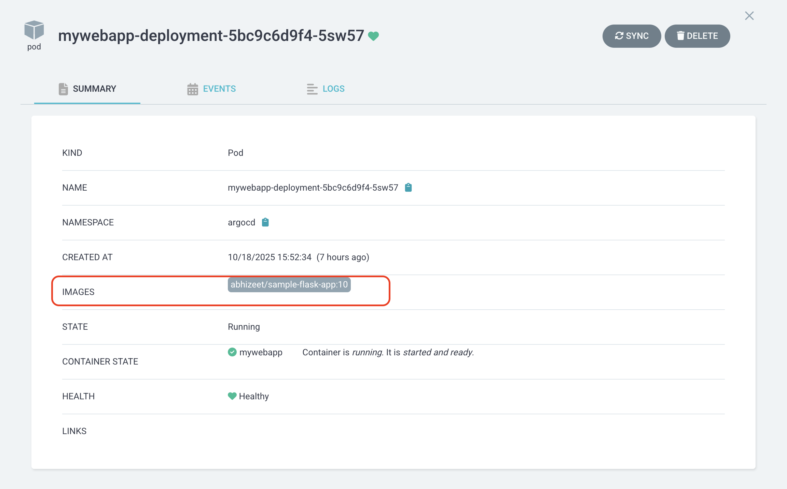

## 💡 The Problem — Manual Tag Updates


Here’s what happens in a traditional CI/CD setup:

1. **Developer pushes code** to GitHub or GitLab.
2. A **CI pipeline** (e.g., Jenkins, GitHub Actions) builds a Docker image with a new tag.
3. The new image is pushed to your registry (Docker Hub, Nexus, Harbor, etc.).
4. The **CD pipeline** updates Kubernetes manifests (via shell script or manual commit).
5. Argo CD detects the change and syncs your cluster.


### Drawback

Your **CD pipeline depends on the CI pipeline**.  
If your CI job fails to update the manifest (for example, due to Git credentials or token issues), the CD step never triggers — even if a new image is already available in the registry.


That’s where **Argo CD Image Updater** comes in.


**Argo CD Image Updater** is an official Argo CD add-on that:

- Watches container registries for new image tags.
- Automatically updates image tags in your GitOps repository.
- Optionally creates pull requests for human review (PR mode).
- Triggers Argo CD to sync the changes into your Kubernetes cluster.

This effectively **decouples CI from CD** — meaning your cluster updates automatically when a new image is available, even if the CI pipeline is idle.


##  Architecture Overview

Here’s the updated GitOps flow with Argo CD Image Updater:


✅ **No dependency on CI for deployments.**  
✅ **Automated tag updates.**  
✅ **Git remains the single source of truth.**

##  Prerequisites

Before you begin, ensure you have:

- A **Kubernetes cluster** (e.g., Minikube, EKS, GKE, or AKS)
- **Argo CD** installed and running in the `argocd` namespace
- **kubectl** installed and configured
- A Git repository containing your Kubernetes manifests
- Optional: Docker registry credentials (for private images)


## 🔧 Step 1: Set Up Your Kubernetes & Argo CD

### 1. Start your cluster (example with Minikube)
``` bash
minikube start
```


### 2. Install Argo CD
```bash
kubectl create namespace argocd
kubectl apply -n argocd \
  -f https://raw.githubusercontent.com/argoproj/argo-cd/stable/manifests/install.yaml
```

### 3. Expose Argo CD server (NodePort)
```bash 
kubectl patch svc argocd-server -n argocd -p '{"spec": {"type": "NodePort"}}'
```

Get the login password:
```bash 
kubectl -n argocd get secret argocd-initial-admin-secret \
  -o jsonpath="{.data.password}" | base64 -d; echo
```

Login URL example:
```bash
https://<minikube-ip>:31154
```


## Step 2: Create and Push a Sample Application

Let’s use a simple Nginx web app example.

Deployment YAML

```yaml
apiVersion: apps/v1
kind: Deployment
metadata:
  name: my-web-app
  labels:
    app: my-web-app
spec:
  replicas: 1
  selector:
    matchLabels:
      app: my-web-app
  template:
    metadata:
      labels:
        app: my-web-app
    spec:
      containers:
      - name: my-web-app
        image: abhizeet/sample-flask-app:v1.2
        ports:
        - containerPort: 80
```

```yaml
apiVersion: v1
kind: Service
metadata:
  name: my-web-app
spec:
  type: NodePort
  selector:
    app: my-web-app
  ports:
  - port: 80
    targetPort: 80
```
Commit and push both files to your GitHub repository.


## Step 3: Add the Application to Argo CD

1. Open the Argo CD UI.

2. Click New Application.

3. Fill out:

    - Application Name: my-web-app

    - Project: default

    - Repository URL: your Git repo URL

    - Path: .

    - Cluster URL: your Kubernetes cluster

    - Namespace: default

    - Sync Policy: automatic (recommended)

Click Create — Argo CD will deploy your application.


## step 4:Install Argo CD Image Updater
Install Image Updater in the same namespace as Argo CD:

```bash
kubectl apply -n argocd \
  -f https://raw.githubusercontent.com/argoproj-labs/argocd-image-updater/master/manifests/install.yaml
```


Check that the pod is running:
```bash
kubectl get pods -n argocd | grep image-updater
```


## Step 5: Configure Image Update Strategy
Argo CD Image Updater uses annotations on your Argo CD Application to determine:

1. Which image to track

2. Which update strategy to use

3. What to do when an update is found


Example (semantic versioning):


```bash
kubectl edit app webapp -n argocd
```


Add the below annotations


```yaml

metadata:
  annotations:
    argocd-image-updater.argoproj.io/image-list: abhizeet/sample-flask-app:v1.x
    argocd-image-updater.argoproj.io/sample-flask-app.update-strategy: semver
    argocd-image-updater.argoproj.io/write-back-method: git:secret:argocd/git-creds
  ```

This means:

- Track image sample-flask-app

- Update using semantic versioning (e.g., v1.2.3)

- Write changes back to Git when a new version is found

## Step 6: Configure Git Credentials

The Image Updater needs write access to your Git repo to commit updated manifests.


Option 1 — HTTPS with Personal Access Token

Create a secret:

```bash
kubectl create secret generic git-credentials \
  -n argocd \
  --from-literal=username=<git-username> \
  --from-literal=password=<git-token>
```


Then, in the annotation as already mentioned in step 5:

```bash
argocd-image-updater.argoproj.io/git-credentials=secret:argocd/git-credentials
```

Option 2 — SSH Key (Recommended)

Generate key:

```bash
ssh-keygen -t ed25519 -C "argocd@yourcompany" -f /etc/argocd/keys/argocd-key
```


Add the public key as a Deploy Key in GitHub
and use the private key to register the repo in Argo CD:


```bash
argocd repo add git@github.com:<username>/<repo>.git \
  --ssh-private-key-path /etc/argocd/keys/argocd-key
```


## Step 7: Test Image Auto-Update

1. Push a new Docker image version:
```bash
docker tag my-web-app:v1.2 my-web-app:v1.3
docker push my-web-app:v1.3
```

2. Check Image Updater logs:
```bash 
kubectl logs -n argocd deploy/argocd-image-updater -f
```
you will see log like this:


3. Refresh your Git repo —
the Deployment.yaml or kustomization.yaml should now reference new version.


4. Argo CD detects the manifest change and auto-syncs the cluster.

##  Step 8: (Optional) Enable PR Mode for Safer Updates

Instead of directly committing to the main branch, let Image Updater create a Pull Request.

Edit the ConfigMap:

```bash
kubectl edit configmap argocd-image-updater-config -n argocd
```
Add:

```yaml
git.write-back-method: "pull-request"
git.user: "argocd-bot"
git.email: "argocd-bot@yourcompany.com"
```
Now, every new image tag will generate a PR you can review and merge manually.

## Step 9: Verify

Check that the application is running with the latest image:




⚡ Benefits of Using Argo CD Image Updater

| Feature                          | Benefit                                    |
| -------------------------------- | ------------------------------------------ |
| **Automatic image detection**    | Removes need for CI-based manifest updates |
| **Decoupled from CI**            | CD runs even if CI fails                   |
| **GitOps-compliant**             | Every change tracked via commit or PR      |
| **Supports multiple registries** | Docker Hub, ECR, GCR, Harbor, etc.         |
| **Flexible update strategies**   | Latest, semver, digest, or alphabetical    |
| **PR mode support**              | Safer for production with human approval   |


Troubleshooting

Issue: repository not accessible / authentication required
→ Check Git credentials and repo URL format (SSH vs HTTPS).

Issue: ImagePullBackOff
→ Verify registry secret in Kubernetes namespace.

Issue: Image Updater not committing changes
→ Check write permissions or token scopes (repo:write).


🏁 Conclusion

With Argo CD Image Updater, you can achieve a fully automated and GitOps-compliant deployment flow:

CI builds and pushes a new image.

Argo CD Image Updater detects the tag and updates your repo.

Argo CD syncs automatically and deploys the new version.

You’ve effectively removed manual tag management and pipeline coupling — giving you a clean, robust, and production-friendly deployment pipeline.


📚 References

Argo CD Official Docs -> https://argo-cd.readthedocs.io/

Argo CD Image Updater -> https://argocd-image-updater.readthedocs.io/en/stable/

Kustomize Documentation --> https://kubectl.docs.kubernetes.io/guides/introduction/kustomize/


